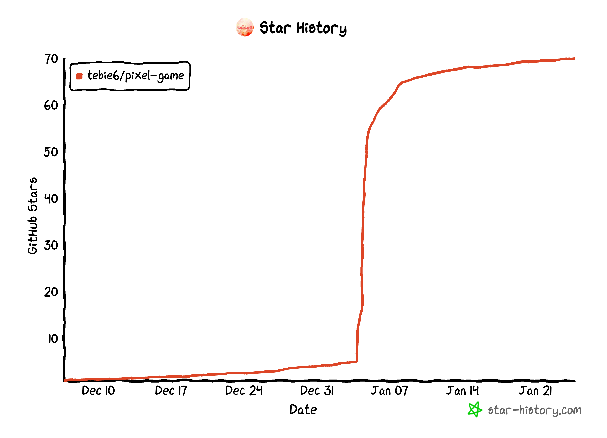

# 像素画游戏 pixel-game

### 一、介绍
> 模仿 reddit论坛的 r/place活动内容，布置一个1000*1000像素的画布，用户可以在画布上部署像素的颜色

##### 浏览地址：[https://game.tebie6.com/](https://game.tebie6.com/)
##### 项目地址：[https://github.com/tebie6/pixel-game](https://github.com/tebie6/pixel-game)
##### 语雀：[https://www.yuque.com/u39134872/zyw7tq/xmds30nc982hhr28](https://www.yuque.com/u39134872/zyw7tq/xmds30nc982hhr28)

#### 项目目录：
```
.
├── conf                                配置文件
│   ├── conf.go
│   ├── conf.ini                        项目配置
│   └── sensitiveDict.txt		敏感词配置
├── cron				定时任务
│   └── cron.go
├── frontend-lib			前端项目
│   ├── static
│   │   └── pixel
│   │       ├── css
│   │       │   └── styles.css
│   │       ├── img
│   │       │   ├── canvas.png
│   │       │   ├── chat.svg
│   │       │   ├── help.svg
│   │       │   └── transparent.png
│   │       └── js
│   │           ├── ConnWs.js
│   │           ├── chart.js
│   │           ├── e-smart-zoom-jquery.js
│   │           ├── e-smart-zoom-jquery.min.js
│   │           ├── jquery-1.11.0.min.js
│   │           └── pako.min.js
│   ├── 2023.html
│   ├── favicon.ico
│   └── pixel.html
├── models				模型定义
│   ├── cacheLoginUsers.go
│   ├── event.go
│   ├── gameErrorContent.go
│   ├── gamePixelRecord.go
│   ├── gameUser.go
│   └── model.go
├── netws				ws数据处理
│   ├── types.go
│   ├── ws.go
│   ├── wsDefault.go
│   └── wsaction.go
├── rpc					RPC请求
│   ├── pixel.go
│   ├── rpc.go				路由配置
│   ├── test.go
│   └── user.go
├── services				服务层
│   ├── pixelService.go
│   └── userService.go
├── socketctrls				socket业务层
│   ├── BaseController.go
│   └── PixelGameController.go
├── storage				日志
├── tools				工具
├── README.md
├── game.sql
├── go.mod
├── go.sum
├── main.go
└── start.sh				启动脚本
```

### 二、安装
#### 1. clone项目
```bash
git clone https://github.com/tebie6/pixel-game.git
```
#### 2. 安装依赖
```bash
go mod tidy
```
#### 3. 运行项目
```bash
go run main.go
```
或
```bash
sh ./start.sh
```
或使用gowatch热编译开发
#### 4. nginx配置
```nginx
server {
	listen 80;
	server_name 你的server_name;
	charset utf-8;
	client_max_body_size 128M;

	root /你的项目地址/pixel-game/frontend-lib;

	gzip on;
	gzip_min_length 2k;
	gzip_buffers 4 16k;
	gzip_http_version 1.1;
	gzip_comp_level 9;
	gzip_types text/plain application/javascript text/css application/xml text/javascript application/x-httpd-php image/jpeg image/gif image/png image/svg;
	gzip_vary on;
	gzip_disable "MSIE [1-6]\.";

	index pixel.html;
	location / {
		try_files $uri $uri/ /pixel.html;
	}

	location /connect {
		proxy_http_version 1.1;
		proxy_read_timeout 360s;
		proxy_redirect off;
		proxy_set_header Upgrade $http_upgrade;
		proxy_set_header Connection "upgrade";
		proxy_set_header Host $host:$server_port;
		proxy_set_header X-Real-IP $remote_addr;
		proxy_set_header REMOTE-HOST $remote_addr;
		proxy_set_header X-Forwarded-For $proxy_add_x_forwarded_for;
		proxy_pass http://127.0.0.1:9022;
	}

	location /api {
		proxy_set_header Host $http_host;
		proxy_set_header X-Real-IP $remote_addr;
		proxy_set_header X-Forwarded-For $proxy_add_x_forwarded_for;
		proxy_set_header X-Forwarded-Proto $scheme;
		proxy_pass http://127.0.0.1:9011;
	}

	location /debug/pprof {
		proxy_set_header Host $http_host;
		proxy_set_header X-Real-IP $remote_addr;
		proxy_set_header X-Forwarded-For $proxy_add_x_forwarded_for;
		proxy_set_header X-Forwarded-Proto $scheme;
		proxy_pass http://127.0.0.1:9033;
	}
}
```
#### 5. SQL
将项目根目录下的 game.sql 导入到数据库
### 三、技术栈

- Go、JS、HTML、CSS、JQ
- MySQL、Redis
- Nginx
### 四、技术介绍
- 项目后端使用GO语言进行开发，前端使用javascript + jQuery + HTML + Css开发
- 通过 e-smart-zoom-jquery.js 实现了对画布的缩放拖拽功能
- 使用Redis进行数据的缓存处理，来提升数据读取加载速度
- 采用websocket全双工协议进行通信，大大增加了用户交互的实时性
- 通过令牌桶算法实现用户部署像素的速率限制问题
- 数据传输使用json作为数据基础格式，对其进行gzip压缩处理，然后通过二进制方式将数据返回给客户端
### 五、画布数据结构
- 1000*1000的面积最大可以存储100万像素点
- 将数据以 x:值, y:值, color:值 的方式存储到redis的hash结构内
### 六、功能
##### 1.工具API
###### 1.1 更新Redis画布数据
> https://your_domian_name/api/pixel/repairContent?password=config.ini中设置的password
##### 2.数据处理-SQL
###### 2.1 违规像素内容的的清理
```sql
## 1、清理指定用户的内容
UPDATE game_pixel_record SET status = 0 WHERE uid = 用户ID;

## 2、清理指定区域的内容（矩形区域）
UPDATE game_pixel_record SET status = 0 WHERE x BETWEEN x1坐标 AND x2坐标 AND y BETWEEN y1坐标 AND y2坐标;

## 执行完sql，调用 1.1重新生成redis画布
```
###### 2.2 用户违规
```sql
## 1、对违规用户封禁
UPDATE game_user SET STATUS = 0 WHERE id = 用户ID;
```
### 七、遇到过的问题
由于是在1核1G1M带宽的服务器上运行，资源有限，所以我们要尽可能的资源最大化利用
#### 1.cpu和内存的飙升
在进行系统性能分析时，注意到，每当新用户建立websocket连接，系统会自动创建多个goroutine，包括写缓冲协程和写协程等。问题出现在用户断开连接后，由于缺乏有效的管理逻辑，这些goroutine并没有被适时回收。这导致了随着用户访问量的增加，未回收的goroutine累积，从而引起CPU和内存资源的过度占用和浪费。
#### 2.画布加载阻塞
##### 2.1 API请求方案
在项目初期，画布数据通过API接口加载，使用Redis的HGETALL命令从哈希结构中检索完整的画布数据（格式：{"x":0,"y":0,"color":0}）。这种方法在处理大量数据时会显著增加CPU和内存的负担。更严重的是，HGETALL作为一个阻塞操作，执行期间会暂停Redis的其他请求处理。为了解决这个问题，转向使用HSCAN命令进行分段查询，有效减轻了Redis在处理单次大型操作时的压力。
##### 2.2 并发请求时画布长时间白屏
由于画布数据量大 1000*1000的画布最大存储100万像素点（10万条数据传输大约2.19MB），对于下行带宽仅为1M的服务器而言，一次性加载如此大的数据量颇具挑战。解决方案为采用分段处理，利用websocket的实时性，将数据分批推送至客户端，实现渐进式加载，缓解了白屏问题。
##### 2.3 高并发下的加载缓慢
尽管websocket渐进式加载缓解了白屏问题，但在高并发场景下，画布仍然无法及时完成加载，主要是由于大量用户请求导致数据推送量超过1M带宽上限。为此，采取以下措施：

1. 优化数据结构，去除冗余内容。
2. 对数据进行压缩，减轻带宽压力。
3. 将数据传输格式由JSON转为更高效的二进制格式。

这些优化使得数据大小减少了约2.8倍，仅占原始数据的35.8%。
##### 2.4 重试风暴问题
原有websocket的心跳机制在带宽有限的情况下，因为无法及时接收到pong响应，导致重试风暴。为解决此问题，首先尝试延长心跳间隔，但效果不佳。最终，改为在接收到任何数据推送时更新心跳并且重连后心跳间隔倍数增加，有效避免了重试风暴。
##### 2.5 画布加载最终版
参考Reddit上的案例，采用通过图片绘制canvas画布的方法。后端会定时监测画布变动，如有变动则生成新的画布图片。这一策略将数据大小进一步降至2.3基础原始数据的20%，大幅优化了画布加载过程。
### 八、资源消耗

- 场景：100个用户同时在线
- 内存消耗：600M左右
- CPU消耗：几乎无占用无波动
- 带宽：像素点击使用250K ～300K
- goroutine：400个左右
### 九、项目许可
MIT

### 十、联系作者
liumingyuphp@163.com

### 十一、感谢
后端支持：LEO
1. Github：https://github.com/phpxin
2. 博客：https://blog.dream128.cn/

前端借鉴：陈俊榕 Wolf Chen
1. 博客：https://wolfchen.top/

### 十二、开发中
- 【多画布】功能正在测试中
- 【自动导航】功能正在测试中

---


